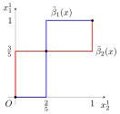

<!-- paginate: true -->
# 非協力ゲーム理論 (基本)
- 参考文献
    - J. W. Weibull, Evolutionary game theory, MIT press, 1997.
---
## ゲーム理論の考え方と応用
- ゲーム理論は合理的な意思決定主体の間の戦略的な相互作用を記述する数学的モデル
    - 応用範囲が広い (e.g. 経済，コンピュータサイエンス)

- 非協力ゲーム理論では，各主体は自分の利益のみを考え，利己的に行動するときについて解析する

- 非協力ゲームにおける古典的な仮定
    - 完全情報
        - エージェントがゲームの情報を完全に分かっている
    - 完全合理性
        - 自身の保有する情報全てを用いて，自身の利益の最大化を実現する

---
## 戦略と利得関数 (Notation)
分析を標準型の有限ゲームに限定する．次のNotationを用いる．
- $n \in \mathbb{N}$: エージェントの総数，$n \geq 2$．
- $\mathcal{N} = \{1, 2, \ldots, n\}$: エージェントの集合
- $S_i, \; \forall i \in I$: エージェント$i$の純粋戦略集合．$S_i = \{1, 2, \ldots, m_i\}$とする．
- $s = (s_1, \ldots, s_n), \; s_i \in S_i \; \forall i \in I$: 純粋戦略プロファイル
- $s_{-i} = (s_1, \ldots, s_{i - 1}, s_{i + 1}, \ldots, s_n)$: $i$以外の戦略プロファイル
- $S = \times_{i \in I} S_i$: 純粋戦略空間
- $U_i: S \to \mathbb{R}$: エージェント$i$の (純粋戦略) 利得関数
- $U: S \to \mathbb{R}^n$: ゲームの結合純粋戦略利得関数
    - $U(s) = (U_1(s), \ldots, U_n(s))$

---
## ゲームの定義
純粋戦略の観点から，標準型ゲームはタプル$G = (\mathcal{N}, S, U)$で定義される．ただし，$\mathcal{N}, S, U$は3ページで定義したものである．

特に，$\mathcal{N} = \{1, 2\}$のときは，利得関数$U_1, U_2$を$m_1 \times m_2$行列として表現できる．
- $A = (a_{hk})_{h \in S_1, k \in S_2}$: エージェント$1$の利得行列．$a_{hk} = U_1(h, k)$．
- $B = (b_{hk})_{h \in S_1, k \in S_2}$: エージェント$2$の利得行列．$b_{hk} = U_2(h, k)$．

例: 囚人のジレンマ
$$
A = \left(\begin{array}{cc}
    4 & 0 \\
    5 & 3
\end{array}\right), \; \; 
B = \left(\begin{array}{cc}
    4 & 5 \\
    0 & 3
\end{array}\right)
$$

---
## 混合戦略
エージェント$i$の混合戦略 = 純粋戦略集合$S_i$上の確率分布

- $x_i = (x_i^1, \ldots, x_i^{m_i})^{\mathrm{T}} \in \mathbb{R}^{m_i}$: エージェント$i$の混合戦略．エージェント$i$が純粋戦略$j \in S_i$をとる確率を並べたベクトル．
- 純粋戦略$j$を混合戦略として考えると，単位ベクトル$e_{m_i}^j$である．

$$
\Delta_i = \left\{x_i  \, \left| \,  \forall j \in S_i, \; x_i^j \geq 0, \;  \sum_{k \in S_i} x_i^k = 1  \right. \right\}
$$
はエージェント$i$の混合戦略集合．
- $\Delta_i$は単位ベクトル$e_{m_i}^j$を頂点とする$m_i - 1$次元単位単体．

---
## 混合戦略の集合

$S_i = \{1, 2\}$のとき，
$$
\Delta_i = \{(x_i^1, 1 - x_i^1)^{\mathrm{T}} \, | \, 0 \leq x_i^1 \leq 1\}
$$
である(左図)．

---
## 混合戦略
すべての混合戦略$x_i \in \Delta_i$は，すべての単位ベクトル (純粋戦略) $e_{m_i}^j$ の凸結合として表される:
$$
x_i = \sum_{j \in S_i} x_i^j e_{m_i}^j
$$

- $C(x_i) = \{j \in S_i \, | \, x_i^j > 0\}$: $x_i \in \Delta_i$のキャリア (台)．
    - 実際に使われる可能性のある戦略の集合．

- $\mathrm{int}(\Delta_i) = \{x_i \in \Delta_i \, | \, \forall j \in S_i, x_i^j > 0\}$: $\Delta_i$の内部．

- $\mathrm{bd}(\Delta_i) = \{x_i \in \Delta_i \, | \, x_i \notin \mathrm{int}(\Delta_i)\}$: $\Delta_i$の境界．

---
## 混合戦略空間
- $\Theta = \times_{i \in \mathcal{N}} \Delta_i$: 混合戦略空間
- $x = (x_1, \ldots, x_n) \in \Theta$: 混合戦略プロファイル

非協力ゲームの標準的なアプローチでは，すべてのエージェントのランダムな行動は統計的に独立であるとする．
$\Rightarrow$ 混合戦略プロファイル$x \in \Theta$がプレーされるとき，純粋戦略プロファイル$s = (s_1, \ldots, s_n) \in S$が起こる確率は，
$$
x(s) = \prod_{i \in \mathcal{N}} x_i^{s_i}
$$
である．

---
## 期待利得
期待利得 = エージェント$i$の利得の期待値

期待利得関数$u_i: \Theta \to \mathbb{R}$
$$
u_i(x) := x(s)U_i(s) = \sum_{j \in S_i} x_i^j u_i(e_{m_i}^j, x_{-i})
$$
- 各エージェントが個別にとる混合戦略の線形関数
- エージェント$i$の純粋戦略に対して，他の全てのエージェントの混合戦略を固定して，エージェント$i$が得る利得に関して重み付けした合計．

- $u: \Theta \to \mathbb{R}^n$: ゲームの結合混合戦略利得関数
    - $u(x) = (u_1(x), \ldots, u_n(x))$

---
## ゲームの混合拡大
混合戦略の観点から，$G = (\mathcal{N}, \Theta, u)$としてゲームを定義する．$\Theta, u$はそれぞれ8, 9ページで定義．

特に2人ゲームのときは，任意の混合戦略$x_1 \in \Delta_1,  x_2 \in \Delta_2$に対して，
$$
u_1(x) = \sum_{j \in S_1} x_1^j u_1(e_{m_1}^2, x_2) = \sum_{j \in S_1} \sum_{k \in S_2} x_1^j x_2^k a_{jk} = (x_1, Ax_2) \\
u_2(x) = \sum_{j \in S_1} \sum_{k \in S_2} x_1^j x_2^k b_{jk} = (x_1, Bx_2) = (x_2, B^{\mathrm{T}}x_1)
$$
と書ける．ただし，$A, B$はそれぞれエージェント1, 2の利得行列．

---
## 最適反応 (純粋戦略最適反応)
$s_i^{*} \in \beta_i(x)$を$x_{-i}$に対する純粋戦略最適反応という．ただし，純粋戦略最適反応対応$\beta_i: \Theta \to 2^{S_i}$は， 
$$
\beta_i(x) = \left\{j \in S_i \, | \, \forall k \in S_i, \; u_i(e_{m_i}^j, x_{-i}) \geq u_i(e_{m_i}^k, x_{-i}) \right\}
$$
で定義される．

- 他のエージェントの混合戦略を固定した下で，自身の期待利得が最大になるような純粋戦略

---
## 最適反応 (混合戦略最適反応)

$x_i^{*} \in \tilde{\beta}(x)$を$x_{-i}$に対する混合戦略最適反応という．ただし，混合戦略最適反応対応$\tilde{\beta}: \Theta \to 2^{\Delta_i}$は
$$
\tilde{\beta}(x) = \{x_i^{*} \in \Delta_i \, | \, \forall x_i^{\prime} \in \Delta_i, \; u_i(x_i^{*}, x_{-i}) \geq u_i(x_i^{\prime}, x_{-i}) \} \\
= \{x_i^{*} \in \Delta_i \, | \, \forall j \notin \beta_i(x), \; {x_i^j}^{*} = 0 \} \\
= \{x_i^{*} \in \Delta_i \, | \, C(x_i^{*}) \subseteq \beta_i(x)  \}
$$
で定義される．

- 他のエージェントの混合戦略を固定した下で，期待利得が最大になるような混合戦略
- 純粋戦略最適反応ではない行動をとる確率を0とした確率の組

---
## ナッシュ均衡
$x^{*} \in \tilde{\beta}(x^{*})$が成り立つとき，$x^{*}$をナッシュ均衡という．
特に，$\tilde{\beta}(x^{*}) = \{x^{*}\}$が成り立つとき，$x^{*}$を強ナッシュ均衡という．

- ナッシュ均衡
    - 戦略プロファイル$x^{*} \in \Theta$が自分自身に対する最適反応になっている ($x^{*} \in \Theta$が$\tilde{\beta}$の不動点である)．
    - すべてのエージェントにとって，その状況が実現されたら戦略を変える動機がないという点で合理的な解
    - 有限ゲームでは必ず存在する (角谷の不動点定理より)

- 強ナッシュ均衡
    - 得られる戦略プロファイルは純粋戦略プロファイル
    - 存在しない場合もある

---
## 例題1
$$
A = \left(\begin{array}{cc}
    2 & -1 \\
    -1 & 1
\end{array}\right), \; \; 
B = \left(\begin{array}{cc}
    1 & -1 \\
    -1 & 2
\end{array}\right)
$$

で定義されるゲーム (男女の争い) のナッシュ均衡を求めよ．

---
## 例題1の解答例 (愚直にやる方法)
エージェント2の混合戦略を$x_2 = (x_2^1, 1 - x_2^1)^{\mathrm{T}}$で固定したとき，エージェント1の純粋戦略の期待利得は，
$$
u_1(e_2^1, x_2) = (e_2^1, Ax_2) = 2x_2^1 - (1 - x_2^1) = 3x_2^1 - 1 \\
u_1(e_2^2, x_2) = (e_2^2, Ax_2) = -x_2^1 + (1 - x_2^1) = -2x_2^1 + 1
$$
である．同様に，エージェント1の期待利得を$x_1 = (x_1^1, 1 - x_1^1)^{\mathrm{T}}$で固定したときのエージェント2の純粋戦略の期待利得は，
$$
u_2(x_1, e_2^1) = (x_1, Be_2^1) = x_1^1 - (1 - x_1^1) = 2x_1^1 - 1 \\
u_2(x_1, e_2^2) = (x_1, Be_2^2) = -x_1^1 + 2(1 - x_1^1) = -3x_1^1 + 2
$$
である．

---
## 例題1の解答例 (愚直にやる方法)
これより，
$$
u_1(e_2^2, x_2) - u_1(e_2^1, x_2) = -5x_2^1 + 2 \\
u_2(x_1, e_2^2) - u_2(x_1, e_2^1) = -5x_1^1 + 3
$$
を得る．よって，エージェント1, 2の混合戦略最適反応対応は
$$
\beta_1(x) = \begin{cases}
    \{e_2^1\} & \mathrm{if} \; \; x_2^1 > \frac{2}{5} \\
    \Delta_1 & \mathrm{if} \; \; x_2^1 = \frac{2}{5} \\
    \{e_2^2\} & \mathrm{if} \; \; x_2^1 < \frac{2}{5}
\end{cases}, \; \; \beta_2(x) = \begin{cases}
    \{e_2^1\} & \mathrm{if} \; \; x_1^1 > \frac{3}{5} \\
    \Delta_2 & \mathrm{if} \; \; x_1^1 = \frac{3}{5} \\
    \{e_2^2\} & \mathrm{if} \; \; x_1^1 < \frac{3}{5}
\end{cases}
$$
である．

---
## 例題1の解答例 (愚直にやる方法)
ナッシュ均衡の定義より，ナッシュ均衡$x^{*}$は，
$$
x^{*} \in \left\{(e_2^1, e_2^1), (e_2^2, e_2^2), \left( \left(\frac{3}{5}, \frac{2}{5} \right)^{\mathrm{T}}, \left(\frac{2}{5}, \frac{3}{5} \right)^{\mathrm{T}} \right) \right\}
$$
と求められる．

---
## ナッシュ均衡の集合の不変性
ナッシュ均衡の集合を$\Theta^{NE}$とする．$\Theta^{NE}$は以下の操作に関して不変である．
- 利得関数への正のアフィン変換
- 利得関数の局所シフト

正のアフィン変換: $\mu_i \in \mathbb{R}, \; \lambda_i \in \mathbb{R}_{++}$
$$
\forall x \in \Theta, \; \tilde{u}_i(x) = \lambda_i u_i(x) + \mu_i
$$

局所シフト: $\mu_i \in \mathbb{R}$
$$
\forall x \in \Theta, \; \tilde{u}_i(x) = \begin{cases}
u_i(x) & \mathrm{if} \; \; x_{-i} \neq \bar{x}_{-i} \\
u_i(x) + \mu_i & \mathrm{if} \; \; x_{-i} = \bar{x}_{-i}
\end{cases}
$$

---
## ナッシュ均衡の集合の不変性
正のアフィン変換: $x_i^{*}, x_i \in \Delta_i, \; x \in \Theta$に対して，
$$
\tilde{u}_i(x_i^{*}, x_{-i}) - \tilde{u}_i(x_i, x_{-i}) = \lambda_i \left(u_i(x_i^{*}, x_{-i}) - u_i(x_i, x_{-i}) \right)
$$

局所シフト: $x_i^{*}, x_i \in \Delta_i, \; x \in \Theta$に対して，
$$
\tilde{u}_i(x_i^{*}, x_{-i}) - \tilde{u}_i(x_i, x_{-i}) = u_i(x_i^{*}, x_{-i}) - u_i(x_i, x_{-i})
$$

であるので，どちらの変換に対しても
$$
\tilde{u}_i(x_i^{*}, x_{-i}) \geq \tilde{u}_i(x_i, x_{-i}) \Leftrightarrow u_i(x_i^{*}, x_{-i}) \geq u_i(x_i, x_{-i})
$$
であるからナッシュ均衡の集合は不変である．

---
## 例題1に関して
$$
A = \left(\begin{array}{cc}
    2 & -1 \\
    -1 & 1
\end{array}\right), \; \; 
B = \left(\begin{array}{cc}
    1 & -1 \\
    -1 & 2
\end{array}\right)
$$
を利得行列として持つゲームは，
$$
A^{\prime} = \left(\begin{array}{cc}
    3 & 0 \\
    0 & 2
\end{array}\right), \; \; 
B = \left(\begin{array}{cc}
    2 & 0 \\
    0 & 3
\end{array}\right)
$$
を利得行列として持つゲームとナッシュ均衡の集合の観点では変わらない．
- $A$について，1列目と2列目にそれぞれ1を加えても最適反応は変わらない．
- $B$について，1行目と2行目にそれぞれ1を加えても最適反応は変わらない．

$\Rightarrow$ 計算は楽になる．

---
## 支配関係
全ての$z \in \Theta$について$u_i(y_i, z_{-i}) \geq u_i(x_i, z_{-i})$が成り立ち，ある$z \in \Theta$については狭義の不等号が成り立つとき，戦略$y_i \in \Delta_i$が戦略$x_i \in \Delta_i$を弱支配するという．

全ての$z \in \Theta$について，$u_i(y_i, z_{-i}) > u_i(x_i, z_{-i})$が成り立つとき，戦略$y_i \in \Delta_i$が戦略$x_i \in \Delta_i$を強支配するという．

この定義から
- 強支配される戦略は最適にはならない $\Rightarrow$ 戦略の反復消去 (自分 $\Rightarrow$ 相手 $\Rightarrow$ 自分 ... というようにする)
- 弱支配される戦略は最適になることもあるが，唯一の最適反応とはならない

---
## 戦略の反復消去
囚人のジレンマを例にする．
$$
A = \left(\begin{array}{cc}
    4 & 0 \\
    5 & 3
\end{array}\right), \; \; 
B = \left(\begin{array}{cc}
    4 & 5 \\
    0 & 3
\end{array}\right)
$$
エージェント1の戦略2 (裏切り) は戦略1 (協力) を強支配している $\Rightarrow$ 戦略1を消去．
$$
A = \left(\begin{array}{cc}
    5 & 3
\end{array}\right), \; \; 
B = \left(\begin{array}{cc}
    0 & 3
\end{array}\right)
$$
エージェント2の戦略2 (裏切り) は戦略1 (協力) を強支配している $\Rightarrow$ 戦略1を消去．
$$
A = \left(\begin{array}{c}
    3
\end{array}\right), \; \; 
B = \left(\begin{array}{c}
    3
\end{array}\right)
$$
反復消去により，戦略プロファイルが1つだけ残る．このプロファイルは強ナッシュ均衡である．
- お互い「協力」を選んだ方が利得は高いのに...というジレンマ．

---
## ナッシュ均衡の精緻化
信憑性のないナッシュ均衡や壊れやすいナッシュ均衡を排除する (refineする)
進化的基準と関係している

- 完全性
- プロパー性
- 強完全性

---

## 摂動ゲーム
完全性: エージェントの戦略の摂動に対して頑健でないナッシュ均衡を排除するもの

ゲームを$G = (\mathcal{N}, \Theta, u)$とする．

$\mu \in \{\mu \in \mathbb{R}_{++}^m \, | \, \forall i \in \mathcal{N}, \;\sum_{j \in S_i} \mu_i^j < 1 \}$: 誤差ベクトル $(m = \sum_{i \in \mathcal{N}} m_i)$ に対し

$$
\Theta(\mu) = \{x \in \Theta \, | \, \forall i \in \mathcal{N}, \; \forall j \in S_i, \; x_i^j \geq \mu_i^j \} \subset \Theta
$$
を定義する．混合戦略を$\Theta(\mu)$に制限したゲーム$G(\mu) = (\mathcal{N}, \Theta(\mu), u)$を$G$の摂動ゲームと呼ぶ．

任意の摂動ゲーム$G(\mu)$は非空のナッシュ均衡の集合$\Theta^{NE}(\mu)$を持つ．

---
## 完全性
ナッシュ均衡$x^{*} \in \Theta^{NE}$が完全であるとは，以下の条件を満たす摂動ゲームの列$\{G(\mu^t)\}_{\mu^t \to 0}$ が存在することをいう:
1. $x^{t}$が$G(\mu^t)$のナッシュ均衡
2. $x^{t} \to x^{*}$

エージェントがある微小な確率で誤った戦略を選択しても，もとのゲームのナッシュ均衡に近い結果が実現されるってこと．

- 任意の内部ナッシュ均衡は完全
- 完全ナッシュ均衡の集合を$\Theta^{PE}$とすると，任意の有限ゲームに対して$\Theta^{PE} \neq \emptyset$ (完全ナッシュ均衡は必ず存在する)．
- 任意の完全ナッシュ均衡$x^{*} \in \Theta^{PE}$は弱支配されない．2人ゲームでは逆も成立．

---
## $\varepsilon$-プロパー
完全性の基準は摂動が合理的であるという条件は課していない．

$x^{*} \in \Theta$が$\varepsilon$-プロパーであるとは，ある$\varepsilon > 0$を与えたときに
$$
\forall i \in \mathcal{N}, \; \forall j, k \in S_i, \; u_i(e_i^j, x_{-i}^{*}) < u_i(e_i^k, x_{-i}^{*}) \Rightarrow {x_i^j}^{*} \leq \varepsilon {x_i^k}^{*}
$$
が成り立つことをいう．
$\Rightarrow$ 利得が小さい (= 損害が大きい) 戦略をとる確率が，利得が大きい戦略を取る確率の$\varepsilon$倍で抑えられる
$\Rightarrow$ 損害が大きい誤りを警戒するように振る舞う

- 任意の内部ナッシュ均衡は，任意の$\varepsilon > 0$に対して$\varepsilon$-プロパーである．

c.f. ナッシュ均衡
$$
\forall i \in \mathcal{N}, \; \forall j, k \in S_i, \; u_i(e_i^j, x_{-i}^{*}) < u_i(e_i^k, x_{-i}^{*}) \Rightarrow {x_i^j}^{*} = 0
$$

---
## プロパー性
ナッシュ均衡$x^{*} \in \Theta^{NE}$がプロパーであるとは，ある列$\varepsilon^t \to 0$に対して，以下の条件を満たす列$\{x(\varepsilon^t)\}_{\varepsilon^t \to 0}$が存在することをいう:
1. $x(\varepsilon^t)$が$\varepsilon^t$-プロパー
2. $x(\varepsilon^t) \to x^{*}$

損害に依存した微小な確率で誤った戦略を選んでも，もとのゲームのナッシュ均衡に近い結果が実現されるってこと．

- 任意の内部ナッシュ均衡はプロパー
- プロパーナッシュ均衡の集合を$\Theta^{PrE}$とすると，任意の有限ゲームにおいて$\Theta^{PrE} \neq \emptyset$ (プロパーナッシュ均衡は存在する)．
- $x^{*} \in \Theta^{NE}$に対して，$x^{*} \in \Theta^{PrE} \Rightarrow x^{*} \in \Theta^{PE}$．

---
## 強完全性
ナッシュ均衡$x^{*} \in \Theta^{NE}$が強完全であるとは，任意の摂動ゲームの列$\{G(\mu^t)\}_{\mu^t \to 0}$に対して以下が成り立つことをいう:
1. $x^{t}$が$G(\mu^t)$のナッシュ均衡
2. $x^{t} \to x^{*}$

エージェントがどのような微小な確率で誤った戦略を選んでも，もとのゲームのナッシュ均衡に近い結果が実現されるってこと．

- 任意の内部ナッシュ均衡は強完全
- 強完全ナッシュ均衡は存在しない場合もある
- 強ナッシュ均衡は強完全であり，一意のナッシュ均衡も強完全である．また，ナッシュ均衡が強完全ならばプロパーである．

---
## ナッシュ均衡に関連する集合の間の包含関係
強ナッシュ均衡の集合を$\Theta^{SNE}$とし，強完全ナッシュ均衡の集合を$\Theta^{SPE}$とする．
このとき，次の包含関係が成り立つ．
$$
\Theta^{SNE} \subseteq \Theta^{SPE} \subseteq \Theta^{PrE} \subseteq \Theta^{PE} \subseteq \Theta^{NE}
$$

このうち，$\Theta^{SNE}$と$\Theta^{SPE}$は空集合になり得るが，他は有限ゲームの場合は空集合にならない．

---
## 対称2人ゲーム
ゲーム$G = (\mathcal{N}, S, U)$が対称2人ゲームであるとは，$\mathcal{N} = \{1, 2\}, S_1 = S_2,$かつ，$\forall (s_1, s_2) \in S, U_1(s_1, s_2) = U_2(s_2, s_1)$となるときをいう．

$\Rightarrow$ 利得行列$A, B$に対して$B = A^{\mathrm{T}}$であるということ $(b_{ij} = a_{ji})$．

例: 囚人のジレンマ
$$
A = \left(\begin{array}{cc}
    4 & 0 \\
    5 & 3
\end{array}\right), \; \; 
B = \left(\begin{array}{cc}
    4 & 5 \\
    0 & 3
\end{array}\right)
$$
は，$B = A^{\mathrm{T}}$を満たすので，対称2人ゲームである．

---
## Notation
次のnotationを用いる．
- $K = \{1, 2, \ldots, k\}$: 純粋戦略の共通集合
- $\Delta = \{x \, | \, \forall i \in K, \; x^i \geq 0, \; \sum_{j \in K} x^j = 1 \}$: 共通の混合戦略集合
- $x \in \Delta$: 1人目のエージェントの混合戦略
- $y \in \Delta$: 2人目のエージェントの混合戦略

$\Rightarrow$ ある混合戦略$y \in \Delta$に対して，純粋戦略$i \in K$をとるときの利得は$u(e_k^i, y) = (e_k^i, Ay)$である．

- $\beta^{*}: \Delta \to 2^{\Delta}$: 相手の戦略$y \in \Delta$に対する最適反応の集合
$$
\beta^{*}(y) = \{x \in \Delta \, | \, u(x, y) \geq u(x^{\prime}, y), \; \forall x^{\prime} \in \Delta \}
$$

$\Rightarrow$ $\tilde{\beta}_1(x, y) = \beta^{*}(y), \; \tilde{\beta}_2(x, y) = \beta^{*}(x)$

---
## 両対称
対称2人ゲームが両対称であるとは，$A^{\mathrm{T}} = A$となるときをいう．

つまり，$A, B$を利得行列としてもつゲームが両対称であるとは，$B = A^{\mathrm{T}}$かつ$A = A^{\mathrm{T}}$である．つまり，$B = A$である．
$\Rightarrow$ $\forall x, y \in \Delta, \; u(x, y) = u(y, x)$

---
## 対称ナッシュ均衡
対称ゲームでは，戦略プロファイル$(x, y) \in \Theta = \Delta^2$がナッシュ均衡$(x, y) \in \Theta^{NE}$となるためには，$x \in \beta^{*}(y)$かつ$y \in \beta^{*}(x)$であることが必要十分．

ナッシュ均衡が対称であるとは，$(x, y) \in \Theta^{NE}$かつ$x = y$であることをいう．

自分自身とのペアがナッシュ均衡となっている戦略の部分集合を
$$
\Delta^{NE} = \{x \in \Delta \, | \, (x, x) \in \Theta^{NE} \}
$$
と表す．

- $\Theta^{NE} \subset \Theta$は最適反応対応$\beta^{*}: \Delta \to 2^{\Delta}$の不動点の集合
- 任意の対称ゲームは少なくとも1つの対称ナッシュ均衡を持つ $(\Delta^{NE} \neq \emptyset)$

---
## 対称 $2 \times 2$ ゲームの分類

利得行列
$$
A = \left(\begin{array}{cc}
    a_{11} & a_{12} \\
    a_{21} & a_{22}
\end{array}\right), \; \; 
A^{\prime} = \left(\begin{array}{cc}
    a_1 & 0 \\
    0 & a_2
\end{array}\right)
$$
$(a_1 = a_{11} - a_{21}, a_2 = a_{22} - a_{12})$
のゲームは対称 $2 \times 2$ ゲームは最適反応の観点で同値．

$\Rightarrow$ 任意の対称 $2 \times 2$ ゲームはこの正規化によって平面上の点$a = (a_1, a_2) \in \mathbb{R}^2$と同一視できる．

---
## カテゴリI

$a_1 < 0, a_2 > 0$の任意のゲームにおいて，戦略2は戦略1を強支配する．
$\Rightarrow$ $\Theta^{NE} = \{(e_2^2, e_2^2)\}$ かつ $\Delta^{NE} = \{e_2^2\}$．

例: 囚人のジレンマ
$$
A = \left(\begin{array}{cc}
    4 & 0 \\
    5 & 3
\end{array}\right)
$$
$\Rightarrow$ $a_1 = -1, a_2 = 3$

カテゴリIVについては，$a_1$と$a_2$の立場を逆転させるとIと同一．
$\Rightarrow$ $\Theta^{NE} = \{(e_2^1, e_2^1)\}$ かつ $\Delta^{NE} = \{e_2^1\}$．

---
## カテゴリII
$a_1 > 0, a_2 > 0$のすべてのゲームは2つの対称強ナッシュ均衡$(e_2^1, e_2^1), (e_2^2, e_2^2)$を持つ．また，混合戦略
$$
\hat{x} = \lambda e_2^1 + (1 - \lambda) e_2^1 \in \Delta, \; \lambda = \frac{a_2}{a_1 + a_2}
$$
は自分自身とのペアがナッシュ均衡．
$\Rightarrow$ $\Theta^{NE} = \{(e_2^1, e_2^1), (e_2^2, e_2^2), (\hat{x}, \hat{x}) \}$ かつ $\Delta^{NE} = \{e_2^1, e_2^2, \hat{x} \}$．

例: 調整ゲーム
$$
A = \left(\begin{array}{cc}
    2 & 0 \\
    0 & 1
\end{array}\right)
$$

---
## カテゴリIII
$a_1 < 0, a_2 < 0$のすべてのゲームは2つの非対称強ナッシュ均衡$(e_2^1, e_2^2), (e_2^2, e_2^1)$を持つ．また，前ページの混合戦略$\hat{x}$は自分自身とのペアがナッシュ均衡である．
$\Rightarrow$ $\Theta^{NE} = \{(e_2^1, e_2^2), (e_2^2, e_2^1), (\hat{x}, \hat{x}) \}$ かつ $\Delta^{NE} = \{\hat{x} \}$．

例: タカ-ハトゲーム
$$
A = \left(\begin{array}{cc}
    (v - c)/2 & v \\
    0 & v/2
\end{array}\right)
$$
($v < c$を仮定)
$\Rightarrow$ $a_1 = (v - c) / 2, a_2 = -v/2$

---
## まとめ
- ゲーム理論は合理的な意思決定主体の間の戦略的な相互作用を記述する数学的モデル
- ナッシュ均衡は全てのエージェントにとって「合理的な」ゲームの解
- ナッシュ均衡の精緻化 (頑健でないナッシュ均衡を排除する)
- 対称2人ゲーム