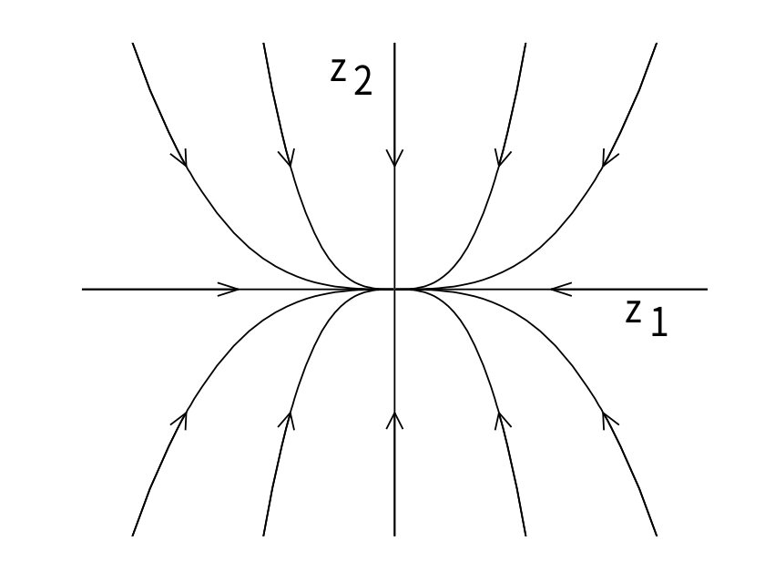
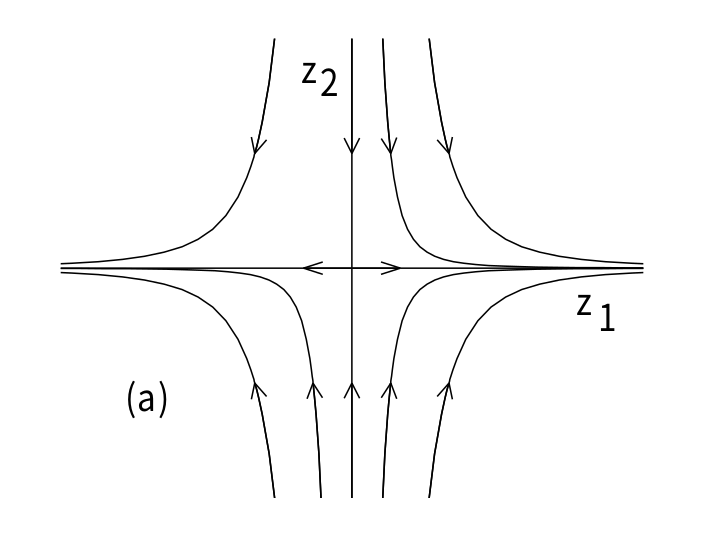
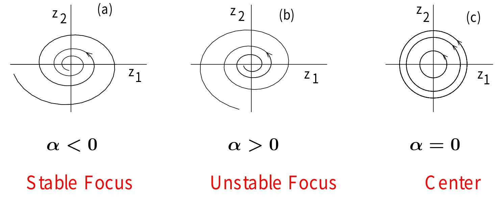
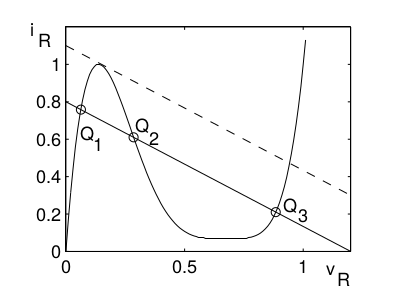

# 非線形システム
- Kosuke Toda (@SeeKT)
### 参考
- H. K. Khalil, Nonlinear systems third edition, 2002.

## 2. Second-Order Systems
2次元のシステムを考える．
$$
\begin{cases}
\dot{x}_1 = f_1(x_1, x_2) = f_1(\boldsymbol{x}) \\
\dot{x}_2 = f_2(x_1, x_2) = f_2(\boldsymbol{x})
\end{cases}
$$
$\boldsymbol{x}(t) = (x_1(t), x_2(t))$を初期状態$\boldsymbol{x}_0 = (x_{10}, x_{20})$からの解とする．このとき，$x_1-x_2$平面における$\boldsymbol{x}(t)$の解の軌跡は，$\forall t \geq 0$で$\boldsymbol{x}_0$からの曲線になる．この曲線のことをtrajectoryまたはorbitという．
さらに，$x_1-x_2$平面のことをstate planeやphase planeという．
軌跡の族のことをphase portraitという．

ベクトル場$f(\boldsymbol{x}) = (f_1(\boldsymbol{x}), f_2(\boldsymbol{x}))$を考える．
任意の$\boldsymbol{x} = (x_1, x_2)$において，$f(\boldsymbol{x}) = (f_1(\boldsymbol{x}), f_2(\boldsymbol{x}))$は$\boldsymbol{x}$におけるtrajectoryの接戦になっている．
$$
\frac{dx_2}{dx_1} = \frac{f_2(\boldsymbol{x})}{f_1(\boldsymbol{x})}
$$
- $x_1$方向に$f_1(\boldsymbol{x})$，$x_2$方向に$f_2(\boldsymbol{x})$だけ変化．

### 線形システムの定性的振る舞い
非線形システムにおいて，平衡点付近の安定性に着目する．
いま，$2 \times 2$のシステム
$$
\dot{\boldsymbol{x}} = A \boldsymbol{x}, \; \; A \text{ is a } 2 \times 2 \text{ real matrix}
$$
を考える．$A = M J_r M^{-1}$とし，
$$
\boldsymbol{x}(t) = M \exp(J_r t) M^{-1}\boldsymbol{x}_0
$$
と書くことができるとする．ただし，
$$
J_r = \left[
    \begin{array}{cc}
    \lambda_1 & 0 \\
    0 & \lambda_2
    \end{array}
    \right] \text{ or } \left[
    \begin{array}{cc}
    \lambda & 0 \\
    0 & \lambda
    \end{array}
    \right] \text{ or } \left[
    \begin{array}{cc}
    \lambda & 1 \\
    0 & \lambda
    \end{array}
    \right] \text{ or } \left[
    \begin{array}{cc}
    \alpha & -\beta \\
    \beta & \alpha
    \end{array}
    \right]
$$
とする$(\lambda_1, \lambda_2, \lambda, \alpha, \beta \in \mathbb{R})$．

変数変換$\boldsymbol{x}(t) = M\boldsymbol{z}(t)$により，
$$
M \dot{\boldsymbol{z}}(t) = AMz(t), \; \; \therefore \dot{\boldsymbol{z}}(t) = J_r\boldsymbol{z}(t)
$$
となる．

#### Case1. $A$の固有値が実数のとき $(\lambda_1 \neq \lambda_2 \neq 0)$
固有値$\lambda_1, \lambda_2$に属する固有ベクトルを$\boldsymbol{v}_1, \boldsymbol{v}_2$とし，$M \coloneqq [\boldsymbol{v}_1, \boldsymbol{v}_2]$とすればよい．
$\boldsymbol{z} = (z_1, z_2)^T$とすると，
$$
\dot{z}_1 = \lambda_1 z_1, \; \dot{z}_2 = \lambda_2 z_2
$$
より，
$$
z_1(t) = z_{10} e^{\lambda_1 t}, \; z_2(t) = z_{20} e^{\lambda_2 t}
$$
から，
$$
z_2 = c z_1^{\lambda_2 / \lambda_1}, \; c = z_{20}/(z_{10})^{\lambda_2/\lambda_1}
$$
よって，phase portraitの形は$\lambda_1, \lambda_2$の符号による．

##### (i) $\lambda_2 < \lambda_1 < 0$のとき
$t \to \infty$で$e^{\lambda_1 t}, e^{\lambda_2 t} \to 0$である．また，$e^{\lambda_2 t}$の方が$e^{\lambda_1 t}$よりも早く$0$に近づく．
このとき，$\lambda_2$を"fast eigenvalue"，$\lambda_1$を"slow eigenvalue"といい，固有ベクトルもfast/slow eigenvectorという．

解軌道は，$z_2 = cz^{\lambda_2 / \lambda_1}$ $(\lambda_2 / \lambda_1 > 1)$ で，原点に向かう．
$$
\frac{dz_2}{dz_1} = c\frac{\lambda_2}{\lambda_1}z_1^{\frac{\lambda_2}{\lambda_1} - 1}
$$
である．このとき，stable nodeという．いま，$z_2$方向はより早く$0$へ向かう．



##### (ii) $\lambda_2 > \lambda_1 > 0$のとき
解軌道は，$\infty$に発散．上の図の矢の向きが逆になる．このとき，unstable node．

##### (iii) $\lambda_2 < 0 < \lambda_1$のとき
$e^{\lambda_1 t} \to \infty, \; e^{\lambda_2 t} \to 0$ as $t \to \infty$．
このとき，$\lambda_2$をstable eigenvalue, $\lambda_1$をunstable eigenvalueといい，固有ベクトルもstable / unstable eigenvalueという．
このとき，Saddleという．

この図の場合は，初めは$z_2$軸方向から$0$に近づき，最終的に$z_1$方向の無限大に発散している．

#### Case2. $A$の固有値が複素数のとき $\lambda_{1, 2} = \alpha \pm j \beta$
このとき，
$$
\dot{z}_1 = \alpha z_1 - \beta z_2, \; \dot{z}_2 = \beta z_1 + \alpha z_2
$$
である．極座標変換を
$$
r = \sqrt{z_1^2 + z_2^2}, \; \theta = \tan^{-1}\left(\frac{z_2}{z_1} \right)
$$
とする．解は，
$$
r(t) = r_0 e^{\alpha t} \text{ and } \theta(t) = \theta_0 + \beta t
$$
と得られる．よって，
- $\alpha < 0$ $\Rightarrow$ $r(t) \to 0$ as $t \to \infty$
- $\alpha > 0$ $\Rightarrow$ $r(t) \to \infty$ as $t \to \infty$
- $\alpha = 0$ $\Rightarrow$ $r(t) \equiv r_0 \; \forall t$
である．それぞれStable Focus, Unstable Focus, Centerという．


### 摂動の影響
$$
A \to A + \delta A \; \; (\delta A \text{ arbitrarily small})
$$
とする．この行列の固有値は$\delta A$の変化によって連続的に変化する．
#### structurally stable
A node (with distinct eigenvalues), a saddle or a focusは，structurally stable．$\delta A$の微小変動によって定性的な振る舞いは変化しない

A stable node (重複度2以上) は微小変動により，
- Stable node
- Stable focus
になる可能性がある．

例: $A$の固有値が$-1$ (重複度2)のとき，固有多項式は，
$$
\Delta (\lambda) = \lambda^2 + 2 \lambda + 1
$$
である(重解)．このとき，$A$の微小変化により，$\Delta (\lambda) = 0$は，
- 2実解をもつ
- 共役複素解を持つ

ことの2つの場合が考えられる．

微小変動において，固有値の実部の正負は変化しない．よって，Stable NodeまたはStable Focus．

また，固有値が純虚数のCenterはstructually stableにならない．
$$
\left(
    \begin{array}{cc}
    0 & 1 \\
    -1 & 0
    \end{array}
    \right) \rightarrow \left(
    \begin{array}{cc}
    \mu & 1 \\
    -1 & \mu
    \end{array}
    \right)
$$
に微小変動したとする．固有値は$\mu \pm j$となる．
- $\mu < 0$: Stable Focus
- $\mu > 0$: Unstable Focus

### 平衡点付近の定性的振る舞い
非線形システムを平衡点付近で線形化する．線形化によって平衡点の種類を決定できるか？
- stable node
- unstable node
- saddle
- stable focus
- unstable focus
- center

2次元のシステム
$$
\begin{cases}
\dot{x}_1 = f_1(x_1, x_2) \\
\dot{x}_2 = f_2(x_1, x_2)
\end{cases}
$$
を考える．ただし，$f_1, f_2$は連続微分可能とする．このシステムの平衡点を$\boldsymbol{p} = (p_1, p_2)^T$とする．$f_1, f_2$を$p$の周りでTaylor展開する．

$
f_1(x_1, x_2) \simeq f_1(p_1, p_2) + \nabla f_1(p_1, p_2)^T (\boldsymbol{x} - \boldsymbol{p}) + \text{H.O.T.}
$
$
f_2(x_1, x_2) \simeq f_2(p_1, p_2) + \nabla f_2(p_1, p_2)^T (\boldsymbol{x} - \boldsymbol{p}) + \text{H.O.T.}
$

ただし，$\boldsymbol{x} = (x_1, x_2)^T$であり，
$$
\nabla f_i(x_1, x_2) = \left( \frac{\partial f_i(x_1, x_2)}{\partial x_1}, \frac{\partial f_i(x_1, x_2)}{\partial x_2} \right)^T, \; i = 1, 2
$$
である．いま，
$$
a_{ij} = \left.\frac{\partial f_i(x_1, x_2)}{\partial x_j}\right|_{\boldsymbol{x} = \boldsymbol{p}}
$$
とおくと，
$
\dot{x}_1 = f_1(p_1, p_2) + a_{11} (x_1 - p_1) + a_{12} (x_2 - p_2) + \text{H.O.T.}
$
$
\dot{x}_2 = f_2(p_1, p_2) + a_{21} (x_1 - p_1) + a_{22} (x_2 - p_2) + \text{H.O.T.}
$
である．新しい変数$\boldsymbol{y}$を$\boldsymbol{y} = \boldsymbol{x} - \boldsymbol{p}$として定義する．このとき，
$$
\dot{\boldsymbol{y}} \approx A \boldsymbol{y}
$$
である．ただし，
$$
A = \left[
    \begin{array}{cc}
    a_{11} & a_{12} \\
    a_{21} & a_{22}
    \end{array}
    \right] = \left.\left[
        \begin{array}{cc}
        \frac{\partial f_1}{\partial x_1} & \frac{\partial f_1}{\partial x_2} \\
        \frac{\partial f_2}{\partial x_1} & \frac{\partial f_2}{\partial x_2}
        \end{array}
        \right]\right|_{\boldsymbol{x} = \boldsymbol{p}} = \left.\frac{\partial f}{\partial \boldsymbol{x}}\right|_{\boldsymbol{x} = \boldsymbol{p}}
$$
は平衡点$\boldsymbol{p}$におけるJacobi行列である．

Jacobi行列$A$の固有値と元の非線形システムの平衡点の種類の関係は以下のようになる．

|$A$の固有値|非線形システムの平衡点の種類|
| ---- | ---- |
|$\lambda_2 < \lambda_1 < 0$ | Stable Node |
| $\lambda_2 > \lambda_1 > 0$ | Unstable Node |
| $\lambda_2 < 0 < \lambda_1$ | Saddle |
| $\alpha \pm j \beta, \; \alpha < 0$ | Stable Focus |
| $\alpha + \pm j \beta, \; \alpha > 0$ | Unstable Focus |
| $\pm j \beta$ | 線形化失敗 |

例: 線形化失敗の例
システム
$$
\begin{cases}
\dot{x}_1 = - x_2 - \mu x_1 (x_1^2 + x_2^2) \\
\dot{x}_2 = x_1 - \mu x_2 (x_1^2 + x_2^2)
\end{cases}
$$
を考える．平衡点は，$\boldsymbol{x} = \boldsymbol{0}$．また，
$$
\frac{\partial f}{\partial \boldsymbol{x}} = \left[
    \begin{array}{cc}
    -\mu(3x_1^2 + x_2^2) & -(1 + 2 \mu x_1 x_2) \\
    (1 - 2 \mu x_1 x_2) & -\mu(x_1^2 + 3x_2^2)
    \end{array}
    \right]
$$
である．平衡点におけるJacobi行列$A$は，
$$
A = \left.\frac{\partial f}{\partial \boldsymbol{x}}\right|_{\boldsymbol{x} = \boldsymbol{0}} = \left[
    \begin{array}{cc}
    0 & -1 \\
    1 & 0
    \end{array}
    \right]
$$
である．
極座標変換$x_1 = r \cos \theta, x_2 = r \sin \theta$を適用すると，$\dot{r} = -\mu r^3, \dot{\theta} = 1$が得られる．
よって，$\mu > 0$のときはStable Focus，$\mu < 0$のときはUnstable Focus．

#### 複数の平衡点が見られる例
例: Tunnel-diode circuit
$$
\begin{cases}
\dot{x}_1 = \frac{1}{C}[-h(x_1) + x_2] \\
\dot{x}_2 = \frac{1}{L}(-x_1 - Rx_2 + \mu)
\end{cases}
$$

- $C = 2$
- $
h(x_1) = 17.76 x_1 - 103.79x_1^2 + 229.62 x_1^3 - 226.31 x_1^4 + 83.72 x_1^5
$
- $L = 5$
- $R = 1.5$
- $\mu = 1.2$

としたときの平衡点は，

$Q_1= (0.063, 0.758), Q_2 = (0.285, 0.61), Q_3 = (0.884, 0.21)$
である．このとき，$Q_1, Q_3$はstable nodeで，$Q_2$はsaddleである．

ここで，$x_1-x_2$平面 (phase space) に対してベクトル場を描画する．
2つの初期状態からダイナミクスに従い$x_1, x_2$を動かした．4th order Runge Kutta methodを実装し，解軌道を描画した．

```python {cmd="/home/toda/.local/share/virtualenvs/MyInterest-mUCP8fiX/bin/python" matplotlib=true}
import numpy as np
import matplotlib.pyplot as plt
import scipy
from scipy.linalg import norm

class draw_phase():
    def __init__(self, C, R, mu, L, Maxitr, h):
        self.C = C
        self.R = R
        self.mu = mu
        self.L = L
        self.Maxitr = Maxitr
        self.h = h
    
    def make_list(self, n):
        return [[] for i in range(n)]

    def func_h(self, x):
        return 17.76*x - 103.79*x**2 + 229.62*x**3 - 226.31*x**4 + 83.72*x**5
    
    def dynamics_x1(self, x1, x2):
        return ((-1)*self.func_h(x1) + x2)/self.C
    
    def dynamics_x2(self, x1, x2):
        return ((-1)*x1 - self.R*x2 + self.mu)/self.L
    
    def dynamics(self, vecx):
        f1 = self.dynamics_x1(vecx[0], vecx[1])
        f2 = self.dynamics_x2(vecx[0], vecx[1])
        return np.array([f1, f2])
    
    def Runge_Kutta(self, x0):
        xlst = [x0]
        for i in range(self.Maxitr):
            curx = xlst[-1]
            k1 = self.dynamics(curx)
            k2 = self.dynamics(curx + self.h*k1/2)
            k3 = self.dynamics(curx + self.h*k2/2)
            k4 = self.dynamics(curx + self.h*k3)
            newx = curx + self.h*(k1 + 2*k2 + 2*k3 + k4)/6
            if norm(newx - curx) < 1e-6:
                break
            else:
                xlst.append(newx)
        return xlst
    
    def draw_function(self):
        X1, X2 = np.meshgrid(np.linspace(-0.1, 1.1, 26), np.linspace(-0.2, 1.1, 26))
        U = self.dynamics_x1(X1, X2); V = self.dynamics_x2(X1, X2)
        xinit1 = np.array([0.5, 1.0]); xinit2 = np.array([0.5, -0.1])
        trj1 = self.Runge_Kutta(xinit1); trj2 = self.Runge_Kutta(xinit2)
        xv1 = self.make_list(xinit1.size); xv2 = self.make_list(xinit2.size)
        for i in range(len(trj1)):
            for j in range(trj1[i].size):
                xv1[j].append(trj1[i][j])
        for i in range(len(trj2)):
            for j in range(trj2[i].size):
                xv2[j].append(trj2[i][j])
        fig = plt.figure()
        ax = fig.add_subplot(111)
        ax.set_xlabel(r"$x_1$"); ax.set_ylabel(r"$x_2$")
        ax.quiver(X1, X2, U, V)
        ax.scatter(0.063, 0.758, c = 'r', label = r"$Q_1$")
        ax.scatter(0.285, 0.61, c = 'r', label = r"$Q_2$")
        ax.scatter(0.884, 0.21, c = 'r', label = r"$Q_3$")
        ax.plot(xv1[0], xv1[1], c = 'b')
        ax.plot(xv2[0], xv2[1], c = 'g')
        ax.legend(loc='best')
        plt.show()

def main():
    C = 2; L = 5; R = 1.5; mu = 1.2
    h = 1e-2; Maxitr = 10000
    obj = draw_phase(C=C, R=R, mu=mu, L=L, Maxitr=Maxitr, h=h)
    obj.draw_function()

if __name__ == "__main__":
    main()
```

Saddleになっている平衡点には収束せず，Stable nodeとなっている平衡点に収束している様子が見てとれる．


### Limit Cycles
#### Oscillation (発振，振動)
システムがnontrivialな周期解を持つとき，振動する．Nontrivialな周期解は，周期$T > 0$に対して，
$$
\boldsymbol{x}(t + T) = \boldsymbol{x}(t), \; \forall t \geq 0
$$
である．

例: Linear (Harmonic) Oscillator
$$
\dot{\boldsymbol{z}} = \left[
    \begin{array}{cc}
    0 & -\beta \\
    \beta & 0
    \end{array}
    \right]\boldsymbol{z}
$$
この解は，
$$
z_1(t) = r_0 \cos(\beta t + \theta_0), \; \; z_2(t) = r_0 \sin(\beta t + \theta_0)
$$
である．ただし，
$$
r_0 = \sqrt{z_1^2(0) + z_2^2(0)}, \; \; \theta_0 = \tan^{-1}\left[\frac{z_2(0)}{z_1(0)} \right]
$$
である．

Linear oscillationは実用的ではない．
- 初期状態の微小変化により解が変化する
- $
\left[
    \begin{array}{cc}
    \mu & \beta \\
    -\beta & \mu
    \end{array}
    \right]
$のような微小変化により，平衡点は
- stable focus ($\mu < 0$)
- unstable focus ($\mu > 0$)
に変化．

これと同様の問題がoscillation of nonlinear systemsにおいても起こる (e.g. pendulum wihtout friction)
- center equilibriumの存在

#### Limit Cycles
例: Negative Resistance Oscillator
システムは，
$$
\begin{cases}
\dot{x}_1 = x_2 \\
\dot{x}_2 = -x_1 - \varepsilon h^{\prime}(x_1) x_2
\end{cases}
$$
である ($\varepsilon > 0$)．
システムの唯一の平衡点は原点であり，Jacobi行列は，
$$
A = \left.\frac{\partial f}{\partial \boldsymbol{x}}\right|_{\boldsymbol{x} = \boldsymbol{0}} = \left[
    \begin{array}{cc}
    0 & 1 \\
    -1 & -\varepsilon h^{\prime}(0)
    \end{array}
    \right]
$$
固有方程式は，
$$
\lambda^2 + \varepsilon h^{\prime}(0) \lambda + 1 = 0
$$
よって，$h^{\prime}(0) < 0$であれば，unstable focusまたはunstable node．

例: Van der Pol Oscillator
$h(x_1) = -x_1 + x_1^3/3$
$$
\begin{cases}
\dot{x}_1 = x_2 \\
\dot{x}_2 = -x_1 - \varepsilon (-1 + x_1^2) x_2
\end{cases}
$$